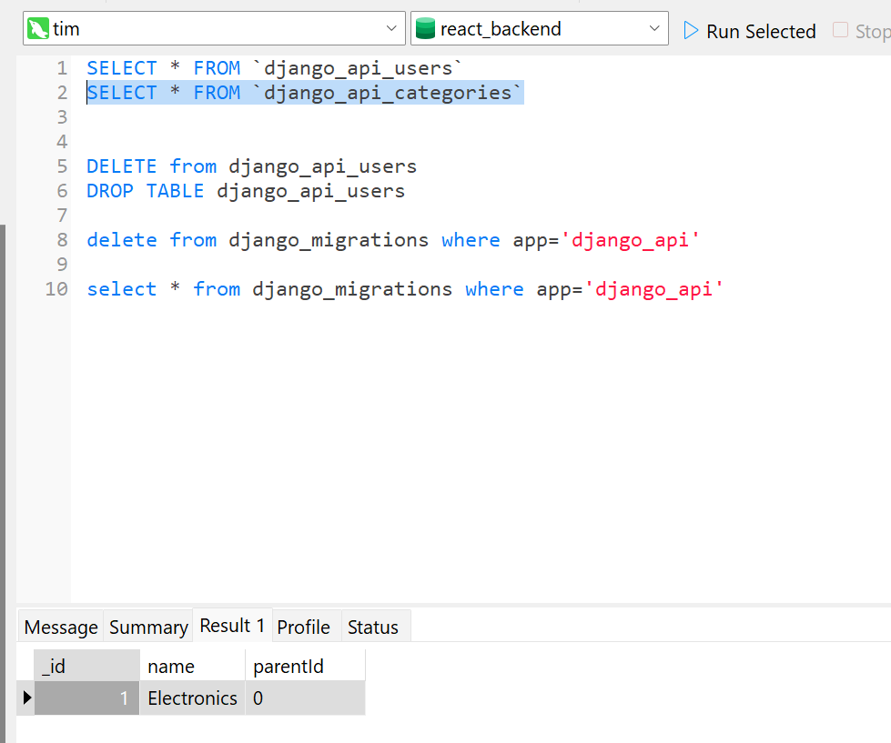
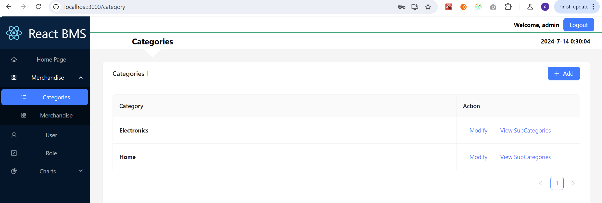

# start
```py
# Create the directory for the project
mkdir back_end_python
cd back_end_python

# Create venv 
py -m venv myvenv
myvenv\Scripts\activate
# on Mac use `source myvenv/bin/activate

# Install Django and REST framework into myvenv
pip install django
pip install djangorestframework

# set up new project
django-admin startproject django_project .
cd django_project
django-admin startapp django_api


pip install django-cors-headers
```

# Database Mysql
```py
# install mysqlclient
pip install mysqlclient
```
# coding
## setting.py
```py
INSTALLED_APPS = [
    'corsheaders',
    'django_api',
    'rest_framework',
]

MIDDLEWARE = [
    'corsheaders.middleware.CorsMiddleware',#Access-Control-Allow-Origin
]
```
# tips
```python
# server will postpone response about 5 seconds after got the request from front-end.
py manage.py runserver
# will resolve the the delay response
py manage.py runserver --noreload
# Allow: GET,POST,HEAD, OPTIONS, Not allowed PUT,PATCH, DELETE  
class CategoriesViewSet(viewsets.ModelViewSet):
# generics.RetrieveUpdateDestroyAPIView will  allowed PUT,PATCH, DELETE 
class CategoriesViewSet(viewsets.ModelViewSet, generics.RetrieveUpdateDestroyAPIView):    
```

## category create



