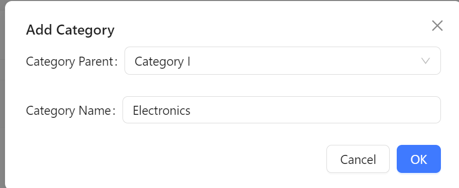

# start
```py
# Create the directory for the project
mkdir back_end_python
cd back_end_python

# Create venv 
py -m venv myvenv
myvenv\Scripts\activate
# on Mac use `source myvenv/bin/activate

# Install Django and REST framework into myvenv
pip install django
pip install djangorestframework

# set up new project
django-admin startproject django_project .
cd django_project
django-admin startapp django_api


pip install django-cors-headers
```

# Database Mysql
```py
# install mysqlclient
pip install mysqlclient
```
# coding
## setting.py
```py
INSTALLED_APPS = [
    'corsheaders',
    'django_api',
    'rest_framework',
]

MIDDLEWARE = [
    'corsheaders.middleware.CorsMiddleware',#Access-Control-Allow-Origin
]
```
# tips
```python
# server will postpone response about 5 seconds after got the request from front-end.
py manage.py runserver
# will resolve the the delay response
py manage.py runserver --noreload
# Allow: GET,POST,HEAD, OPTIONS, Not allowed PUT,PATCH, DELETE  
class CategoriesViewSet(viewsets.ModelViewSet):
# generics.RetrieveUpdateDestroyAPIView will  allowed PUT,PATCH, DELETE 
class CategoriesViewSet(viewsets.ModelViewSet, generics.RetrieveUpdateDestroyAPIView):    
```
## install Django filter
### tutorial: https://django-filter.readthedocs.io/en/stable/guide/rest_framework.html
```
 pip install django-filter
```
## category create



## API (Categories)
```
# (get: get categories, post: create category): 
http://127.0.0.1:8000/api/categories/ 
# (put,patch: update category ,delete: remove category): 
http://127.0.0.1:8000/api/categories/_id/
# filter(get: get by parentId) : 
http://127.0.0.1:8000/api/categories/?parentId=2

```
## API (products)
```
# (get: get products, post: crete product)
http://127.0.0.1:8000/api/products/ 
# (put,patch: update product, delete: remove product)
http://127.0.0.1:8000/api/products/_id/ 
```
## API (roles)
```
# (get: get roles, post: crete role)
http://127.0.0.1:8000/api/roles/ 
# (put,patch: update role, delete: remove role)
http://127.0.0.1:8000/api/roles/_id/ 
## save picture to and get picture form back-end & save array to Mysql

```
## API (users)
```
# (get: get users, post: crete user)
http://127.0.0.1:8000/api/users/ 
# (put,patch: update user, delete: remove user)
http://127.0.0.1:8000/api/users/_id/ 
```
## save picture to and get picture form back-end & save array to Mysql


# API detail

# API For python django rest framework back-end

## catalogue：
	1). auth/login
	2). add user
	3). update user
	4). get users
	5). delete user
    6). add category
	7). get categories
	8). update category
	9). get category by id
    10). add merchandise
	11). get merchandise
	12). add role
	13). get roles
	14). ahthorize rights to role

## 1.1 Auth

### reqURL：
	http://localhost:8000/api/login/

### method：
	POST

### params
	|param		 |required|type     |memo
	|username    |Y       |string   |username
	|password    |Y       |string   |password(md5)

### response：
```
	success:
    { 'data': 
        {'token': "8e2a301b5c75fc19669328feaacdaa7829824b86"}
      'status': 0
 

	error
	  {
        "status": 1,
        "msg": "username or password err!"
      }
```
## 1.2 login validate
### reqURL：
	http://localhost:8000/api/users/getuser/

### method：
	POST

### params
	|param		 |required|type     |memo
	|username    |Y       |string   |username
	|password    |Y       |string   |password(md5)

### response：
```
success:
     { 
        "status": 0,
        "data": {
            "url": "http://localhost:8000/api/users/3/",
            "username": "admin",
            "password": "21232f297a57a5a743894a0e4a801fc3",
            "phone": "6723806541",
            "email": "chanchiuxyz@gmail.com",
            "role_id": "0",
            "create_time": 1720917813,
            "_id": "3"
        }    
     }

 

	error
	  {
        "status": 1,
        "msg": "username or password err!"
      }
```

## 2. add user

### reqURL：
	http://localhost:8000/api/users/

### method:
	POST

### params
	|param		|required |type     |memo
	|username    |Y       |string   |username
	|password    |Y       |string   |password
	|phone       |N       |string   |mobile
	|email       |N       |string   |email
	|role_id     |N       |string   |role id

### response
```
	{
        "url": "http://localhost:8000/api/users/6/",
        "username": "ChiuChan",
        "password": "3667cd4ff2a99ee4b8848307de798075",
        "phone": "6723806541",
        "email": "chanchiuxyz@gmail.com",
        "role_id": "4",
        "create_time": 1721721007,
        "_id": "6"
    }
```

## 3. update user
### reqURL：
	http://localhost:8000/api/users/

### method:
	PATCH

### params

	|param		|required |type     |memo
	|_id         |Y       |string   |ID
    |username    |N       |string   |username
    |phone       |N       |string   |phone
    |email       |N       |string   |email
    |role_id     |N       |string   |role id

### response
```
{
    "url": "http://localhost:8000/api/users/6/",
    "username": "ChiuChan",
    "password": "3667cd4ff2a99ee4b8848307de798075",
    "phone": "6723806541",
    "email": "chanchiuxyz@gmail.com",
    "role_id": "5",
    "create_time": 1721721007,
    "_id": "6"
}
```

    
## 4. get users
### reqURL：
	http://localhost:8000/api/users/

### method:
	GET

### params: 
	none

### response
```
[
    {
        "url": "http://localhost:8000/api/users/3/",
        "username": "admin",
        "password": "21232f297a57a5a743894a0e4a801fc3",
        "phone": "6723806541",
        "email": "chanchiuxyz@gmail.com",
        "role_id": "3",
        "create_time": 1720917813,
        "_id": "3"
    },
    {
        "url": "http://localhost:8000/api/users/4/",
        "username": "test",
        "password": "098f6bcd4621d373cade4e832627b4f6",
        "phone": "6723806541",
        "email": "chanchiuxyz@gmail.com",
        "role_id": "5",
        "create_time": 1720917813,
        "_id": "4"
    },
    {
        "url": "http://localhost:8000/api/users/6/",
        "username": "ChiuChan",
        "password": "3667cd4ff2a99ee4b8848307de798075",
        "phone": "6723806541",
        "email": "chanchiuxyz@gmail.com",
        "role_id": "4",
        "create_time": 1721721007,
        "_id": "6"
    }
]
```

## 5. delete user
### reqURL：
	http://localhost:8000/api/users/

### method:
	DELETE

### params:

	|param		|required |TYPE     |memo
	|userId     |Y       |string   |user id

### response
	{
	}


##  6 add category
### reqURL：
    http://localhost:8000/api/categories/

### method
    POST

### parameter:

    |parameter		|required |type     |memo
    |parentId      |Y       |string   |father's id
    |categoryName  |Y       |string   |categoryname

### response：
```
    {
        "url": "http://localhost:8000/api/categories/4/",
        "name": "Books",
        "parentId": "0",
        "_id": "4"
    }  
```
## 7 get categories(filter)
### reqURL：
	http://localhost:8000/api/categories/?parentId=0

### method：
	GET

### parameter 


### response：
```
[
    {
        "url": "http://127.0.0.1:8000/api/categories/2/",
        "name": "Electronics",
        "parentId": "0",
        "_id": "2"
    },
    {
        "url": "http://127.0.0.1:8000/api/categories/3/",
        "name": "Fashion",
        "parentId": "0",
        "_id": "3"
    },
    {
        "url": "http://127.0.0.1:8000/api/categories/4/",
        "name": "Books",
        "parentId": "0",
        "_id": "4"
    },
    {
        "url": "http://127.0.0.1:8000/api/categories/5/",
        "name": "Toys",
        "parentId": "0",
        "_id": "5"
    },
    {
        "url": "http://127.0.0.1:8000/api/categories/6/",
        "name": "TV&Home Theatre",
        "parentId": "0",
        "_id": "6"
    },
    {
        "url": "http://127.0.0.1:8000/api/categories/11/",
        "name": "Home",
        "parentId": "0",
        "_id": "11"
    }
]
```

## 8 modify category
### reqURL：
    http://localhost:8000/api/categories/_id/
### method:
    PATCH

### parameter:

    |parameter		|required |type     |memo
    |name  |Y       |string   |name

### response：
{
    "url": "http://127.0.0.1:8000/api/categories/2/",
    "name": "Electronic",
    "parentId": "0",
    "_id": "2"
}

## 9 get category name by category id
### reqURL：
	http://127.0.0.1:8000/api/categories/_id/

### method：
	GET

### parameter 


### response：：
{
    "url": "http://127.0.0.1:8000/api/categories/3/",
    "name": "Fashion",
    "parentId": "0",
    "_id": "3"
}
      


##  10 add merchandise
### reqURL：
    http://127.0.0.1:8000/api/products/

### method:
    POST

### parameter:
    |parameter		 |required |type     |memo
    |categoryId    |Y       |string   |categoryId
    |pCategoryId   |Y       |string   |parentCategoryId
    |name          |Y       |string   |name
    |desc          |N       |string   |desc
    |price         |N       |string   |price
    |imgs          |N       |array    |imgs pics'name (json string)
### response:
```
[
    {
        "url": "http://localhost:8000/api/products/4/",
        "name": "HP 15.6\" FHD Business Laptop",
        "categoryId": "12",
        "pCategoryId": "2",
        "price": "849",
        "desc": "Intel Core i5-1135G7, 32GB DDR4 RAM, 1TB PCIe SSD, Intel Iris Xe Graphics, Numpad, Webcam, Wi-Fi 5, Bluetooth, Silver, Win 11 Pro, 32GB Hotface USB Card",
        "status": 1,
        "imgs": [
            "81I6lbcTLIL._AC_SL1500_.jpg",
            "81vCpjk02EL._AC_SL1500_.jpg",
            "81YYMWWOFkL._AC_SL1500_.jpg"
        ],
        "_id": "4"
    }
]
```

## 11 get merchandise
### reqURL：
    http://127.0.0.1:8000/api/products/

### method:
    GET

### parameter:

    |parameter|isRequired |type     |memo
    |pageNum    |Y       |Number   |page number
    |pageSize   |Y       |Number   |page size

### response：
```
 [
    {
        "url": "http://localhost:8000/api/products/4/",
        "name": "HP 15.6\" FHD Business Laptop",
        "categoryId": "12",
        "pCategoryId": "2",
        "price": "849",
        "desc": "Intel Core i5-1135G7, 32GB DDR4 RAM, 1TB PCIe SSD, Intel Iris Xe Graphics, Numpad, Webcam, Wi-Fi 5, Bluetooth, Silver, Win 11 Pro, 32GB Hotface USB Card",
        "status": 1,
        "imgs": [
            "81I6lbcTLIL._AC_SL1500_.jpg",
            "81vCpjk02EL._AC_SL1500_.jpg",
            "81YYMWWOFkL._AC_SL1500_.jpg"
        ],
        "_id": "4"
    }
]
```

## 12 add role

### reqURL：
    http://127.0.0.1:8000/api/roles/

### method:
    POST

### parameter:
    |parameter |isRequired |type     |memo
    |roleName    |Y       |string   |role name

### response
    {
        "url": "http://localhost:8000/api/roles/5/",
        "name": "agent",
        "authname": "admin",
        "auth_time": "2024-07-21T09:11:15.242240Z",
        "menus": [
            "Merchandise",
            "/category",
            "/merchandise"
        ],
        "create_time": "2024-07-21T09:01:09.455749Z",
        "_id": "5"
    }


## get roles
### reqURL：
    http://127.0.0.1:8000/api/roles/

### method:
    GET

### parameter: 
    -

### parameter
   ```
   [
    {
        "url": "http://localhost:8000/api/roles/3/",
        "name": "admin",
        "authname": "",
        "auth_time": "2024-07-21T09:00:09.979508Z",
        "menus": [],
        "create_time": "2024-07-21T09:00:09.979508Z",
        "_id": "3"
    },
    {
        "url": "http://localhost:8000/api/roles/4/",
        "name": "test",
        "authname": "",
        "auth_time": "2024-07-21T09:00:26.487202Z",
        "menus": [],
        "create_time": "2024-07-21T09:00:26.487202Z",
        "_id": "4"
    },
    {
        "url": "http://localhost:8000/api/roles/5/",
        "name": "agent",
        "authname": "admin",
        "auth_time": "2024-07-21T09:11:15.242240Z",
        "menus": [
            "Merchandise",
            "/category",
            "/merchandise"
        ],
        "create_time": "2024-07-21T09:01:09.455749Z",
        "_id": "5"
    }
]
   ```

## update role (authorize)
### reqURL：
    http://127.0.0.1:8000/api/roles/

### method:
    PATCH

### parmeter:
  
    |parmeter	|isRequired  |type     |memo
    |_id          |Y       |string   |id
    |menus        |Y       |array    |path array
    |auth_time    |Y       |number   |authorize time
    |auth_name    |Y       |string   |authorizer

### response
    {
        "url": "http://localhost:8000/api/roles/5/",
        "name": "agent",
        "authname": "admin",
        "auth_time": "2024-07-21T09:11:15.242240Z",
        "menus": [
            "Merchandise",
            "/category"
        ],
        "create_time": "2024-07-21T09:01:09.455749Z",
        "_id": "5"
    }

